# [REGRESSION LOSSES](https://github.com/tuantle/regression-losses-pytorch)

So in machine learning algorithms, specificly deep learning in this case, there is an important algorithmic component that requires maximizing an objective. And this is achieved with a proper loss function that maps the network's outputs onto a loss surface where we can use a gradient descent algorithm to stochasticly traverse down toward a global minima or atleast as close to it.

In this experiment, we will take a look at some loss functions and see how they compare against eachother in a regression task. The test setup is going to be simple and non-rigorous - just compare result metrics such as loss / accuracy and training time or one perticular training task.

All the code was implemented with Pytorch.

## Controls

For comparison, we are going to have two groups, a control group and a test group. Functions in the control group are the standard mean squared & mean absolute error loss functions. These will be used as base references to check how well the loss functions in the test group perform.

- MSE Loss
- MAE Loss

## Tests

Functions in the test group below are all convex and share the same characteristic where their first order derivatives have asymptotes of 1 as  and -1 as .

Another shared characteristic is that they approximate MSE loss when
 and approximate MAE loss when .

- Log-cosh Loss
    - 

    - 

    <p align="center">
        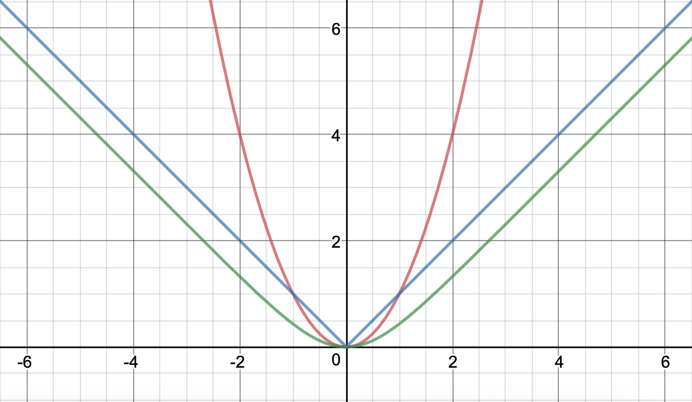
    </p>
    *Plot of Log-cosh loss (green) overlaying MSE loss (red) and MAE loss (blue)*

    <p align="center">
        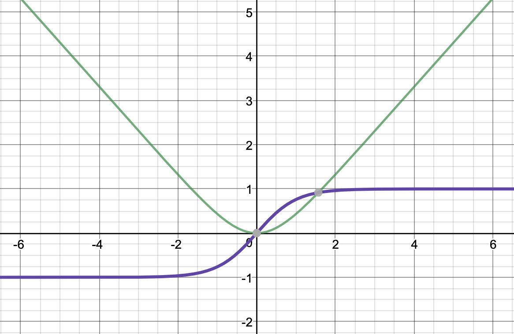
    </p>
    *Plot of Log-cosh loss (greed) and its derivative (purple)*

- XSigmoid Loss
    - 

    - 

    <p align="center">
        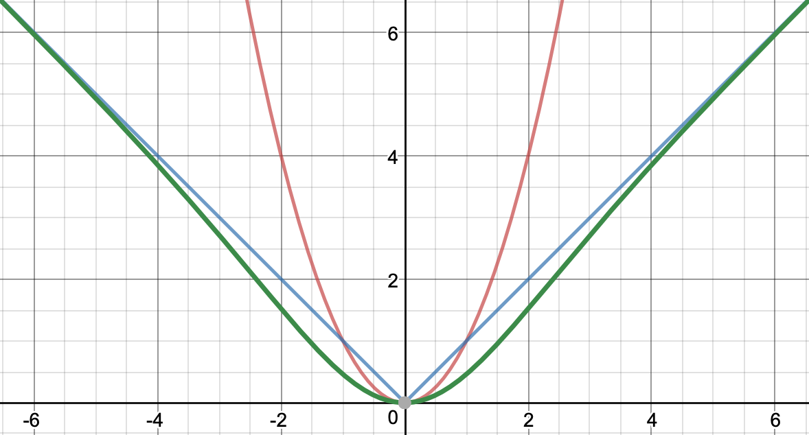
    </p>
    *Plot of XSigmoid loss (green) overlaying MSE loss (red) and MAE loss (blue)*

    <p align="center">
        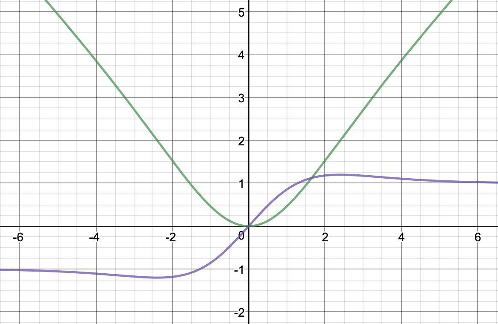
    </p>
    *Plot of XSigmoid loss (greed) and its derivative (purple)*

- XTanh Loss
    - 

    - 

    <p align="center">
        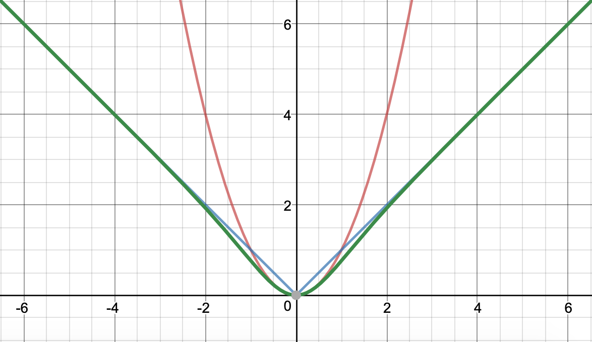
    </p>
    *Plot of XTanh loss (green) overlaying MSE loss (red) and MAE loss (blue)*

    <p align="center">
        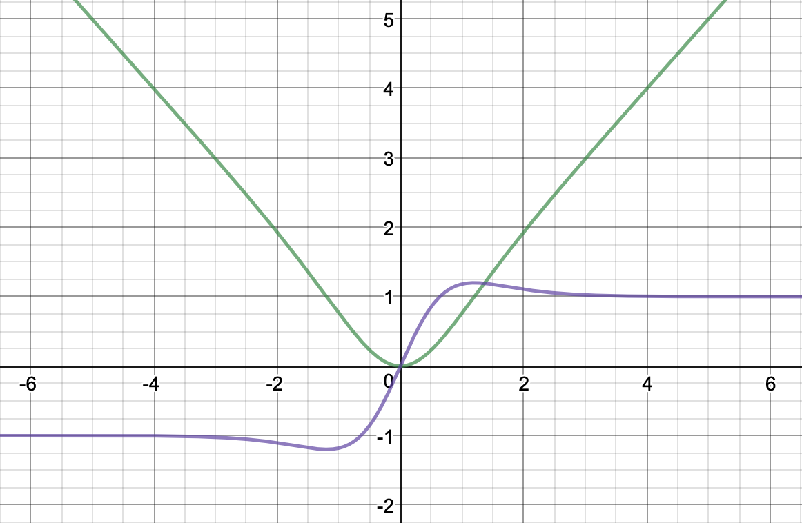
    </p>
    *Plot of Xtanh loss (greed) and its derivative (purple)*

<!-- - Algebraic Loss
    - 

    - 

    <p align="center">
        
    </p>
    *Plot of Algebraic loss (red) overlaying MSE loss (blue) and MAE loss (green)* -->

## Setup

For our experiment, we will be using pytorch framework and MNIST dataset. Pytorch is great for experimentation and super easy to setup. MNIST is a basic starting dataset that we can use for now. And the type of experiment is to recontruct MNIST ditgits using a simple autoencoder network model with a regression loss objective.

```python
import os
import warnings
import time
import copy
import json
import numpy as np

import torch
from torch.utils.data import DataLoader
from torchvision.utils import save_image
from torchvision import datasets, transforms

import seaborn as sns
from matplotlib import pyplot
```

```python
class LogCoshLoss(torch.nn.Module):
    def __init__(self):
        super().__init__()

    def forward(self, y_t, y_prime_t):
        ey_t = y_t - y_prime_t
        return torch.mean(torch.log(torch.cosh(ey_t + 1e-12)))


class XTanhLoss(torch.nn.Module):
    def __init__(self):
        super().__init__()

    def forward(self, y_t, y_prime_t):
        ey_t = y_t - y_prime_t
        return torch.mean(ey_t * torch.tanh(ey_t))


class XSigmoidLoss(torch.nn.Module):
    def __init__(self):
        super().__init__()

    def forward(self, y_t, y_prime_t):
        ey_t = y_t - y_prime_t
        return torch.mean(2 * ey_t / (1 + torch.exp(-ey_t)) - ey_t)


class AlgebraicLoss(torch.nn.Module):
    def __init__(self):
        super().__init__()

    def forward(self, y_t, y_prime_t):
        ey_t = y_t - y_prime_t
        return torch.mean(ey_t * ey_t / torch.sqrt(1 + ey_t * ey_t))

```

```python
class MNISTAutoencoderModel(torch.nn.Module):
    def __init__(self):
        super().__init__()

        self._monitor = {
            'elapse_total_ms': 0,
            'learning': {
                'losses': []
            },
            'testing': {
                'losses': []
            }
        }
        self._scheduler = None
        self._optim = None
        self._criterion = None
        (self._encoder_fc, self._latent_fc, self._decoder_fc) = self._construct()

    def forward(self, x_t):
        x_t = self._encoder_fc(x_t)
        x_t = self._latent_fc(x_t)
        x_t = self._decoder_fc(x_t)
        return x_t
```

The autoencoder model for the experiment is very simple. We will have a 2 layers encoder and 3 layers decoder with ReLU activation for input and hidden layers. The decoder output will have a Tanh activation. At the bottleneck, a batch norm layer is added. Input size is a tensor of shape (N, 28x28), where 28x28 is the MNIST image resolution flatten to a 784 dimensional vector and N is the batch size. At the bottleneck layer, the latent layer size is compressed down to (N, 64).

<p align="center">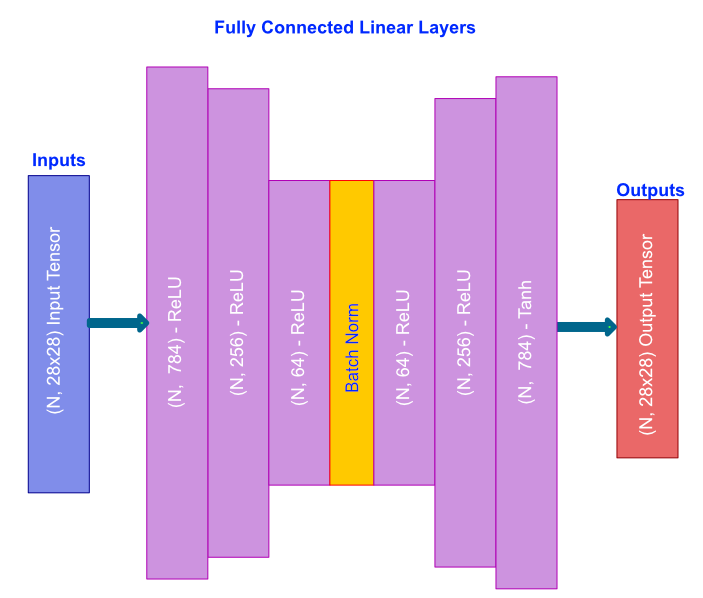</p>

```python
    @staticmethod
    def _construct():
        encoder_seqs = []
        latent_seqs = []
        decoder_seqs = []

        encoder_fclayer1 = torch.nn.Linear(in_features=28 * 28, out_features=256)
        torch.nn.init.xavier_normal_(encoder_fclayer1.weight)
        encoder_fclayer1.bias.data.fill_(0.0)
        encoder_seqs.append(encoder_fclayer1)
        encoder_seqs.append(torch.nn.ReLU(inplace=True))

        encoder_fclayer2 = torch.nn.Linear(in_features=256, out_features=64)
        torch.nn.init.xavier_normal_(encoder_fclayer2.weight)
        encoder_fclayer2.bias.data.fill_(0.0)
        encoder_seqs.append(encoder_fclayer2)
        encoder_seqs.append(torch.nn.ReLU(inplace=True))

        latent_fclayer1 = torch.nn.Linear(in_features=64, out_features=64)
        torch.nn.init.xavier_normal_(latent_fclayer1.weight)
        latent_fclayer1.bias.data.fill_(0.0)
        latent_seqs.append(latent_fclayer1)
        latent_seqs.append(torch.nn.BatchNorm1d(num_features=64))
        latent_seqs.append(torch.nn.ReLU(inplace=True))

        decoder_fclayer2 = torch.nn.Linear(in_features=64, out_features=256)
        torch.nn.init.xavier_normal_(decoder_fclayer2.weight)
        decoder_fclayer2.bias.data.fill_(0.0)
        decoder_seqs.append(decoder_fclayer2)
        decoder_seqs.append(torch.nn.ReLU(inplace=True))

        decoder_fclayer1 = torch.nn.Linear(in_features=256, out_features=28 * 28)
        torch.nn.init.xavier_normal_(decoder_fclayer1.weight)
        decoder_fclayer1.bias.data.fill_(0.0)
        decoder_seqs.append(decoder_fclayer1)
        decoder_seqs.append(torch.nn.Tanh())

        return (torch.nn.Sequential(*encoder_seqs), torch.nn.Sequential(*latent_seqs), torch.nn.Sequential(*decoder_seqs))
```

For any good experiment, reproducibility is important and we want both the control and test setups to have the same initial state. To do that we need to set the framework random seed to some constant.
```python
# Set random seed to a fixed value at the beginning
np.random.seed(2)
torch.manual_seed(2)
```
We also want the weights and biases of the network to be the same for every trial. So before running the experiment, we need to load the same initial state of the network for the control and test setups.
```python
if not os.path.isfile('models/initial_state.pth'):
    torch.save(MNISTAutoencoderModel().to(DEVICE).state_dict(), 'models/initial_state.pth')
initial_state = torch.load('models/initial_state.pth')

exp_model = MNISTAutoencoderModel().to(DEVICE)
cntl_model = MNISTAutoencoderModel().to(DEVICE)

# Loading the same initial network model state for both tests and controls
exp_model.load_state_dict(initial_state)
cntl_model.load_state_dict(initial_state)
```

Due to the lack of GPUs to run training on the entire MNIST dataset, the number of MNIST digit samples were limited to just 512 and batch size of 32.

```python
epoch_limit = 50
batch_size = 32
tl_split = 0.2
ds_sample_size = 512
lr = 2e-3
```

```python
ds_loader = DataLoader(datasets.MNIST('datasets',
                                      train=True, download=True,
                                      transform=transforms.Compose([transforms.ToTensor(), transforms.Normalize((0.5, 0.5, 0.5), (0.5, 0.5, 0.5))])),
                       batch_size=ds_sample_size, shuffle=False)

for ds in ds_loader:
    input_t = ds[0].to(DEVICE)
    input_t = input_t.view(input_t.size(0), -1)
    expected_output_t = input_t
    break
```

Control - training with MSE Loss

```python
cntl_model.load_state_dict(initial_state)
cntl_model.setup(criterion='mse', optim='adam', lr=lr)
cntl_model.learn(input_t, expected_output_t, epoch_limit=epoch_limit, batch_size=batch_size, tl_split=tl_split)
torch.save(cntl_model.state_dict(), 'models/cntl/trained_cntl_mse_adam.pth')
with open('results/cntl/monitor_mse_adam.json', 'w') as monitor_json_file:
    json.dump({
        'learning': cntl_model.monitor['learning'],
        'testing': cntl_model.monitor['testing']
    }, monitor_json_file)
monitors['mse'] = cntl_model.monitor
```

Experiment - training with XSigmoid Loss

```python
exp_model.load_state_dict(initial_state)
exp_model.setup(criterion='xsl', optim='adam', lr=lr)
exp_model.learn(input_t, expected_output_t, epoch_limit=epoch_limit, batch_size=batch_size, tl_split=tl_split)
torch.save(exp_model.state_dict(), 'models/exp/trained_exp_xsl_adam.pth')
with open('results/exp/monitor_xsl_adam.json', 'w') as monitor_json_file:
    json.dump({
        'learning': exp_model.monitor['learning'],
        'testing': exp_model.monitor['testing']
    }, monitor_json_file)
monitors['xsl'] = exp_model.monitor
```

[Full Source Code](https://github.com/tuantle/regression-losses-pytorch/blob/master/regression_losses.py)

Installation and running the experiment.

```
git clone https://github.com/tuantle/regression_losses_pytorch.git
virtualenv regression_losses_pytorch
cd regression_losses_pytorch
source bin/activate
```

```
pip3 install torch torchvision numpy matplotlib seaborn
```

```
python regression_losses.py
```

## Results

After training on 512 MNIST ditgit samples for 50 epoches, learning loss curves are shown below for control and experimental loss functions.

Looking at the zoomed in section of the learning loss curves, MSE and XTanh losses are pretty much identical with MSE slightly better. Log-cosh and XSigmoid losses are also identical with XSigmoid being a wee bit better. And lastly, MAE loss is the worst performer for this type of recontruction learing task.

<p align="center">
    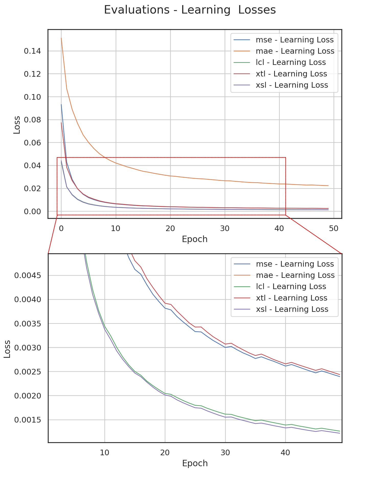
</p>
<p align="center">
    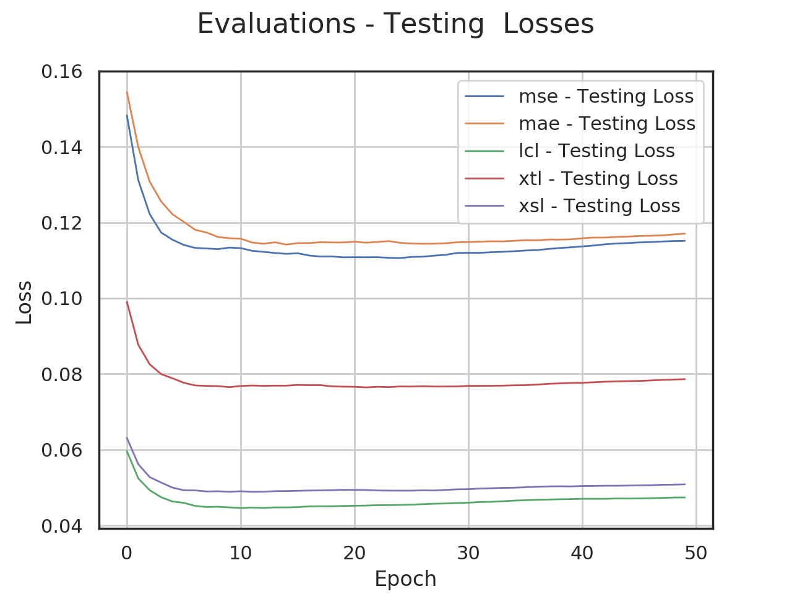
</p>

Below are the results of the reconstructed ditgits of the control and test trails compare with eachother and ground truth.
 Notice the examples where the digits were recontructed correctly (green box) and incorrectly (red box) across both control and test loss functions.

- Ground truth
<p align="center">
    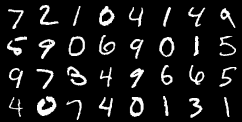
</p>

- MAE Loss
<p align="center">
    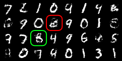
</p>

- MSE Loss
<p align="center">
    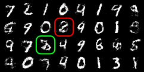
</p>

- Log-cosh Loss
<p align="center">
    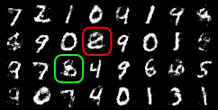
</p>

- XTanh Loss
<p align="center">
    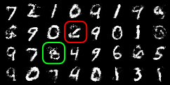
</p>

- XSigmoid Loss
<p align="center">
    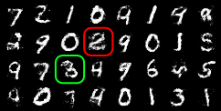
</p>

## Summary

The table below shows the result summary for MNIST digit recontruction. XSigmoid loss function got the best learning loss while Log-cosh got the best testing loss. Log-cosh also got the fastest time.

Even though this is not thorough experiment, results do give some indication of how different loss functions perform for this particular case of recontructing MNIST digits. The take a way is that it is useful to test various loss functions and compare the performances for your particular dataset and model setup.


| Function | Elapse Time   | Learning Loss  | Testing Loss   |
|----------|---------------|----------------|----------------|
| MAE      | 330 s         | 0.022329868    | 0.117060758    |
| MSE      | 335 s         | 0.002394330    | 0.115144573    |
| Log-cosh | **324 s**     | 0.001261333    | **0.047380354**|
| XTanh    | 332 s         | 0.002436433    | 0.078622870    |
| XSigmoid | 335 s         | **0.001216892**| 0.050838538    |
